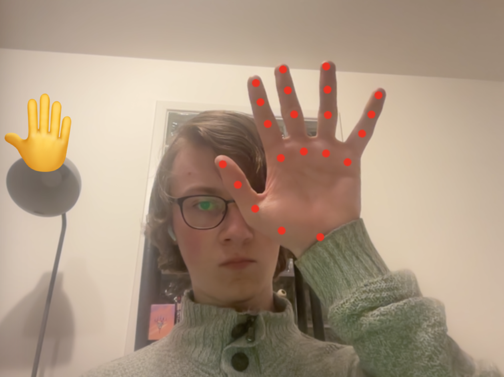

# Hand Pose Detection ✋

Experiments with hand pose detection in Tensorflow.js.



## How to Install

First, clone the project repository:

```
git clone https://github.com/capjamesg/hand-pose-detection
```

Then, open the `pose.html` file in your browser.

See the supported actions below for guidance on what you can do with the app.

## Supported Actions 👍

The following hand gestures are recognized:

1. **Thumbs up**: Make a thumbs up emoji appear.
2. **Thumbs down**: Make a thumbs down emoji appear.
3. **Open palm**: Make an open palm then move your palm down to scroll down and up to scroll up. If your move your hand closer to the screen, the page background will turn green. If you move your hand further away from the screen, the page background will turn lavender.
4. **Fist**: Make a fist emoji appear.

## License

This project is licensed under an [MIT license](LICENSE).
